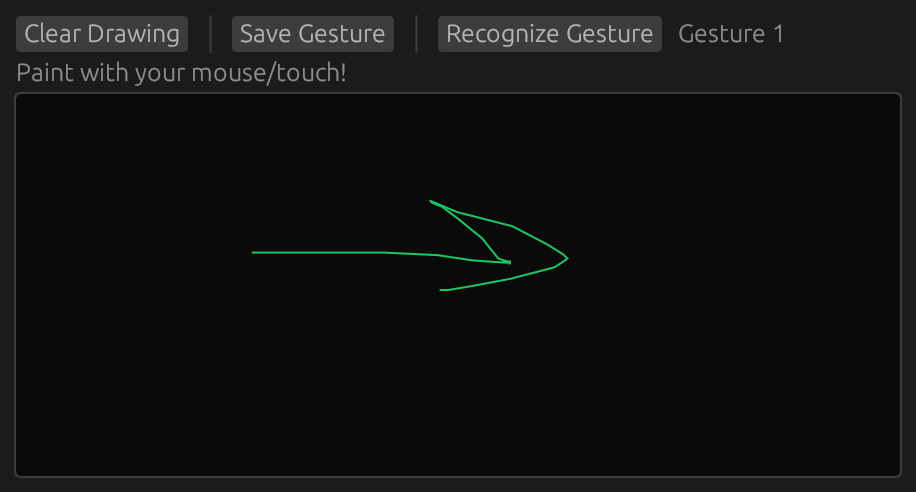

Rust implementation of the [$Q, $P, and $P+ gesture recognizers](http://depts.washington.edu/acelab/proj/dollar/qdollar.html).

Based on the original author's C# implementation, which was translated to Rust using the help of GitHub Copilot. Reviewed by a human.

At this point, only the $Q recognizer has been tested. There's no unit tests. Code might still be sub-optimal. Use at your own risk.

There's an egui-based demo app. Run it with `cargo run --example=q-recognize-demo`

